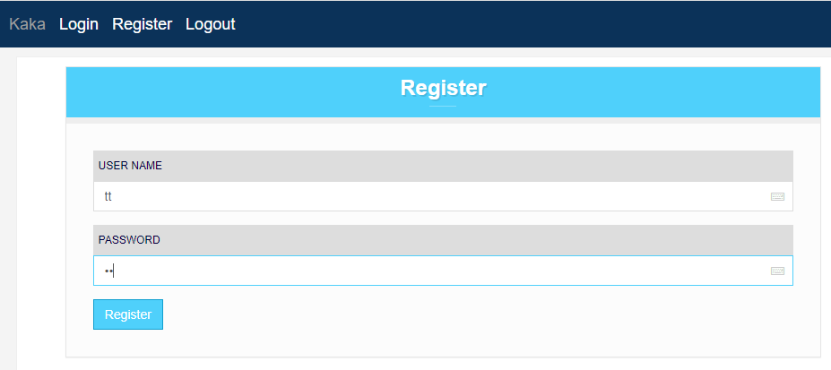

# mobifoneservice-imaging-doctor
Medical imaging doctor developed by Mobifone Service

**Development environment**

- OS: Windows 10 Pro 201H2 19044.1826
- GPU: GeForce GT 1030
- Python: 3.8.0
- Pytorch version: 1.12.0
- Tensorflow version: 2.9.1

# Deploying model 

- Remote (ssh) to GCP server
- Go to folder `cd /home/tunguyen37659/python/HAM10000_001`
- Upload model (IRV2+SA.hdf5) (already existing one)
- Execute in cmd: `conda activate djangoenv002`
- Execute in cmd: `python manage.py runserver 0.0.0.0:8000`
- Go to http://35.220.190.201:8080/Ham10000-0.1/login to test the system

# Steps to loading and get skin lesion type predicted back
- Register your user name and password

